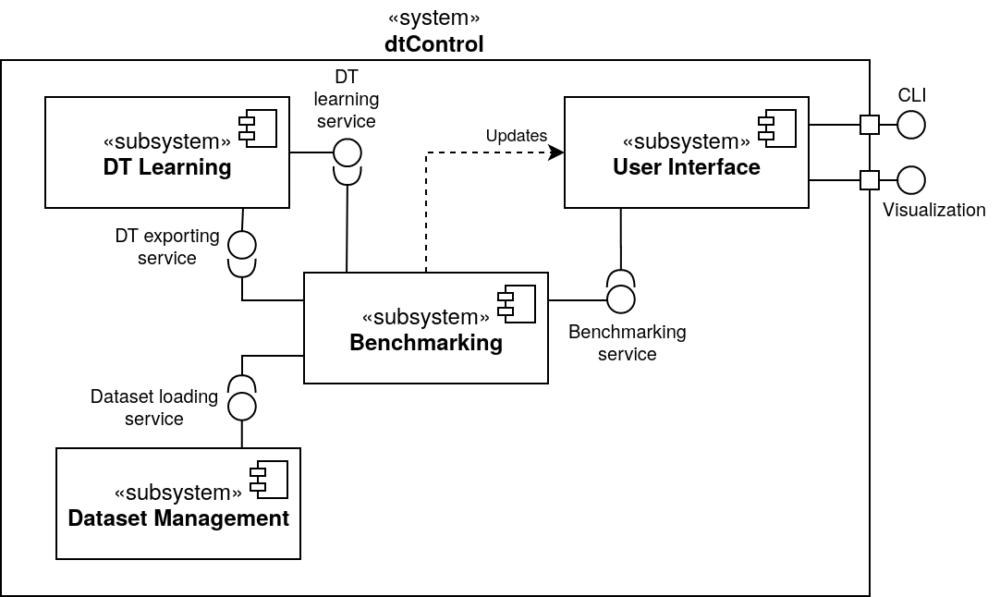
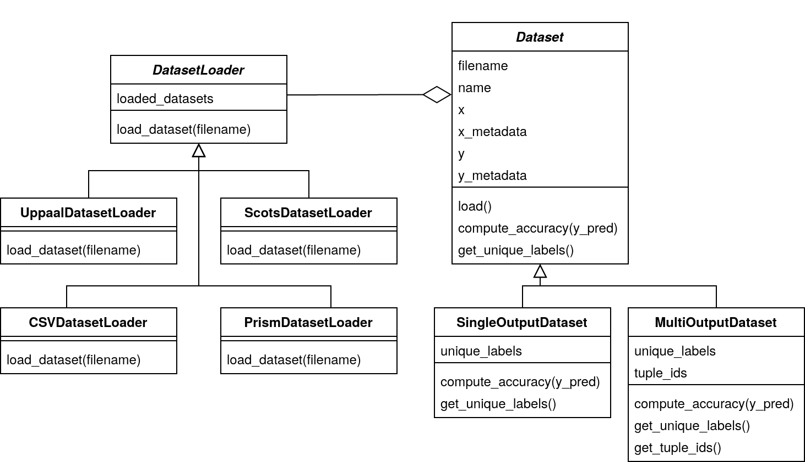

Developer Manual
================

This document aims to provide the reader with the necessary information to be able to extend or customize dtControl. We first give an overview of the general software architecture of the tool. Then, we show how support for controllers in new file formats can be added, explain the inner workings of the decision tree (DT) learning component, and explore how dtControl could be extended with new output formats.

Overview
--------

dtControl is written entirely in Python and makes use of both the `numpy <https://numpy.org/>`_ and `scikit-learn <https://scikit-learn.org/stable/>`_ packages for data representation and manipulation. A basic familiarity with this programming environment is assumed throughout this manual. More information on dependencies can be found in the provided `readme <https://gitlab.lrz.de/i7/dtcontrol/-/blob/master/README.rst>`_ and `setup.py <https://gitlab.lrz.de/i7/dtcontrol/-/blob/master/setup.py>`_ files.

An overview of the software architecture of dtControl is given in the following UML component diagram:

The heart of the tool is formed by the *DT Learning* subsystem, which is responsible for the actual decision tree algorithms and representation. It provides all of the different options for training DTs and can export the learned trees in the DOT and C format.

To make the DT learning itself independent of any verification tool, the *Dataset Management* has been extracted into a separate subsystem, which mainly provides functionality for loading and converting controllers from many different sources such as `SCOTS <https://www.hcs.ei.tum.de/en/software/scots/>`_, `Uppaal Stratego <http://people.cs.aau.dk/~marius/stratego/>`_, and `PRISM <http://prismmodelchecker.org/>`_.

The *Benchmarking* component is responsible for running a set of different given DT learning configurations on a number of specified controllers. It thus uses both the functionality provided by the Dataset Management and the DT Learning subsystems.

Finally, the *User Interface* serves as the main entry point for user interaction with the tool, in the form of a CLI. The constructed HTML files with benchmark statistics also belong to the user interface.

Supporting new file formats
---------------------------

dtControl currently supports the file formats generated by the the tools `SCOTS <https://www.hcs.ei.tum.de/en/software/scots/>`_, `Uppaal Stratego <http://people.cs.aau.dk/~marius/stratego/>`_, and `PRISM <http://prismmodelchecker.org/>`_. There are two ways to make the tool work with other formats, as described in the following.

The CSV format
^^^^^^^^^^^^^^

The first option is to convert the new file format to a custom CSV format that dtControl also supports. We now describe the specification of the custom CSV format.

The first two lines of the file are reserved for metadata. The first line must always reflect whether the controller is permissive (non-deterministic) or non-permissive (deterministic). This is done using either of the following lines::

   #PERMISSIVE

or::

   #NON-PERMISSIVE

The second line must reflect the number of state variables (or the state dimension) and the number of control input variables (or the input dimension). This line looks as follows::

   #BEGIN N M

where `N` is the state dimension and `M` is the input dimension.

Every line after the 2nd line lists the state action/input pairs as a comma separated list::

   x1,x2,...,xN,y1,y2,...,yM

if the controller prescribes the action ``(y1,y2,...,yM)`` for the state ``(x1,x2,...,xN)``. If the state allows more actions, for example, ``(y1’,y2’,...,yM’)``, then this should be described on a new line::

   x1,x2,...,xN,y1,y2,...,yM
   x1,x2,...,xN,y1’,y2’,...,yM’

An excerpt of the ``10rooms.scs`` controller written in this CSV format would look as follows::

   #PERMISSIVE
   #BEGIN 10 2
   18.75,20.0,18.75,18.75,20.0,18.75,18.75,18.75,18.75,18.75,1.0,1.0
   20.0,20.0,18.75,18.75,20.0,18.75,18.75,18.75,18.75,18.75,1.0,1.0
   21.25,20.0,18.75,18.75,20.0,18.75,18.75,18.75,18.75,18.75,1.0,1.0
   18.75,21.25,18.75,18.75,20.0,18.75,18.75,18.75,18.75,18.75,0.0,1.0
   18.75,21.25,18.75,18.75,20.0,18.75,18.75,18.75,18.75,18.75,0.5,1.0
   18.75,21.25,18.75,18.75,20.0,18.75,18.75,18.75,18.75,18.75,1.0,1.0
   20.0,21.25,18.75,18.75,20.0,18.75,18.75,18.75,18.75,18.75,0.0,1.0

dtControl will automatically look for files with a .csv extension and parse them with the assumption that they follow this format.

Implementing a new dataset loader – the dataset management subsystem
^^^^^^^^^^^^^^^^^^^^^^^^^^^^^^^^^^^^^^^^^^^^^^^^^^^^^^^^^^^^^^^^^^^^^

Additionally, it is also possible to integrate the new file format natively into dtControl by providing a dataset loader. For this, we will take a closer look at the *Dataset Management* subsystem.

An overview of the subsystem is given in the following UML class diagram:

The ``Dataset`` class is what the DT learning algorithm needs to train a decision tree. A ``Dataset`` can either be a ``SingleOutputDataset`` if it only has a single control input, or a ``MultiOutputDataset`` if there are multiple control inputs.

.. note::
    Since the code focuses on the decision trees themselves, it refers to the *output* of those trees, which is the same as the action produced by the controller, i.e. the control *input*.

Its most important properties are detailed in the following:

* ``x`` is a simple `NumPy <https://numpy.org/>`_ array containing the values of the state variables. It has dimension #number of states in the controller ✕ #number of state variables.

* ``x_metadata`` is a dictionary containing metadata about the array ``x``. For instance, it contains the names of the variables (if available), the minimum and maximum value in ``x``, and indicates which columns of ``x`` are categorical.

* ``y`` is a NumPy array containing the actions that can be performed for every state. Its format differs, depending on whether the dataset is single- or multi-output:

  * In the case of single-output datasets, ``y`` is a two-dimensional array where each row contains all (non-deterministic) actions that can be performed at the corresponding row of ``x``. Instead of the actual (possibly) floating point values, we use integer indices representing those values throughout the code; the mapping of indices to the actual values can be found in ``dataset.index_to_value``. Since NumPy usually cannot deal with rows of different sizes, but we have varying numbers of possible actions, some rows have to be filled with ``-1`` s. These ``-1`` s have to be ignored during tree construction.

  * In the case of multi-output datasets, ``y`` is a three-dimensional array whose first dimension (or axis) corresponds to the different control inputs. Thus, there is a two-dimensional array for each control-input, which exactly matches the structure outlined above. The DT learning algorithms implemented so far all convert from this representation to the *tuple ID* representation in which every action ``(y1,y2,...,yM)`` is replaced with a single tuple id. The method ``get_tuple_ids()`` returns an array of labels in this tuple ID representation, which again matches the structure of the ``y`` array in the single-output case.

* ``y_metadata`` is a dictionary containing metadata about the array ``y``. Similarly to ``x_metadata``, it indicates which columns of ``y`` are categorical outputs, and provides some other information such as the minimum and maximum value in ``y``.

The ``Dataset`` class provides some auxiliary functionality for the DT learning algorithm, such as ``compute_accuracy(y_pred)`` and ``get_unique_labels()``, as well as a ``load()`` method that uses a ``DatasetLoader`` to actually load the dataset from a file into the internal NumPy representation.

It is this ``DatasetLoader`` class that needs to be extended in order to add support for a new file format to dtControl. A new ``DatasetLoader`` must provide exactly one method: ``_load_dataset()`` parses a file in the new format and returns the tuple ``(x, x_metadata, y, y_metadata, index_to_value)`` which corresponds to the attributes of a ``Dataset`` as outlined above.

The new dataset loader can be registered in the ``extension_to_loader`` dictionary in the ``Dataset`` class. Now, if dtControl encounters a file with an extension of the new file format, it will attempt to load it using the registered loader.

You may find inspiration for writing your own dataset loader in some of the already existing ones such as the ``UppaalDatasetLoader`` or the relatively simple ``PrismDatasetLoader``. However, they are very specific to their respective file format.

Extending dtControl with new algorithms - the decision tree learning subsystem
------------------------------------------------------------------------------

dtControl already supports a wide variety of decision tree construction algorithms. Furthermore, the tool can readily be extended with new algorithms, as we will see in this section.

We again start with a UML diagram of the DT learning subsystem. In order to keep it as flexible as possible, we use a composition-based approach that makes heavy use of interfaces. This has the advantage that you only need to develop against a specific interface if you want to only extend a part of the DT learning algorithm. For instance, if you want to add a new impurity measure, you just have to provide an implementation of the ``ImpurityMeasure`` interface and your code will immediately integrate with the rest of the learning algorithm.

As can be seen, the heart of the component is the ``DecisionTree`` class, which offers the core methods one would expect:

- ``fit(dataset)`` constructs a decision tree for a dataset.
- ``predict(dataset)`` returns a list of control inputs predicted for a dataset.
- ``get_stats()`` returns the statistics to be displayed in the benchmark results as a dictionary. This will mainly include the number of nodes and potentially some algorithm-specific statistics.
- ``print_dot()`` saves a representation of the decision tree in the `DOT <https://en.wikipedia.org/wiki/DOT_(graph_description_language)>`_ format.
- ``print_c()`` exports the decision tree to a C-file as a chain of if-else statements.
- ``print_vhdl()`` returns the corresponding vhdl code.
- ``toJSON()`` converts the ``DecisionTree`` object to a ``JSON`` dictionary.

Most of these methods simply delegate to the ``root`` object of type ``Node``, which implements the actual decision tree data structure. It has mostly the same attributes as a ``DecisionTree``, as well as some statistics and either a list of children or a label. Depending on the dataset and algorithm, a label can be one of the following:

- A single integer (that appears in the ``index_to_value`` dictionary) corresponding to a single action

- A single tuple of integers corresponding to a single action with multiple outputs

- A list of integers corresponding to multiple possible actions

- A list of tuples corresponding to multiple possible actions with multiple outputs

We now examine the most important interfaces in detail.

.. _splitting-strategies:

Splitting strategies
^^^^^^^^^^^^^^^^^^^^

A ``SplittingStrategy`` provides the method ``find_split(dataset, impurity_measure)``, which returns the best predicate of a certain type, given a dataset and an impurity measure. For instance, the ``AxisAlignedSplittingStrategy`` searches through all possible axis-aligned splits for the given dataset and returns the one with lowest impurity. Additionally, if several different splitting strategies are in use, the user can assign an individual priority to the strategies. The priority is later taken into account when calculating the impurity of the predicate :math:`p_i`. The new impurity (with priority in :math:`(0,1]`) is calculated as the following:

.. math::
        \text{Impurity}_\text{new}(p_i) = \displaystyle\frac{\text{Impurity}(p_i)}{\text{Priority}}

.. note::
        The default value of ``priority`` is 1. By assigning the exclusive priority of 0, the user can specify a ``FallbackStrategy``, a strategy which should only be used if all other strategies fail.

The returned predicate is of type ``Split`` and must provide the following methods:

- ``predict(features)`` returns an index into the ``children`` list of a ``Node`` corresponding to the child that should be picked for the given NumPy array of features.

- ``get_masks(dataset)`` returns a list of NumPy masks indicating how the dataset is split. A mask is just a one-dimensional array of boolean values with a length of ``len(dataset)``. A value of ``True`` in the jth row of the ith mask indicates that the jth row in ``dataset.x`` belongs to the ith sub-dataset created by the split.

- ``print_dot()`` returns the string that should be put in the node in the DOT format.

- ``print_c()`` returns the string that should be put in the corresponding if-statement in the C code.

- ``print_vhdl()`` returns the string that corresponds to vhdl code.

- ``to_json_dict()`` converts the ``Split`` object to a ``JSON`` dictionary.

The simplest example of a ``Split`` is probably the ``AxisAlignedSplit``.

Impurity measures
^^^^^^^^^^^^^^^^^

An ``ImpurityMeasure`` needs to provide the ``calculate_impurity(dataset, split)`` method, which simply returns a float indicating the impurity. There are two types of impurity measures:

* ``MultiLabelImpurityMeasures`` directly compute the impurity from the nondeterministic labels. Examples include ``MultiLabelEntropy`` and ``MultiLabelGiniIndex``.

* ``DeterminizingImpurityMeasures`` correspond mostly to the traditional impurity measures known from decision trees in machine learning. Examples include ``Entropy`` and ``GiniIndex``. These impurity measures are called *determinizing* since they don't directly work on the nondeterministic labels. Instead, the use a ``Determinizer`` that first converts the labels to a new representation.

  By default, the ``LabelPowersetDeterminizer`` is used, which treats every combination of possible labels as a unique label and thus preserves all of the nondeterminism present in the original controller. Other options are for example the ``MaxFreqDeterminizer``, which implements the maximum frequency determinization technique. Determinizers can either be applied before or after splitting, as indicated by the ``is_pre_split()`` method.

Determinization
^^^^^^^^^^^^^^^

The final ingredient of the DT learning algorithm - determinization - is mainly controlled by the ``early_stopping`` attribute of a ``DecisionTree``. If it is set to ``True``, early stopping is performed and the resulting DT is thus (possibly) smaller and more deterministic. This parameter should always be enabled if impurity measures that make use of determinization are used, such as the ``MultiLabelEntropy`` or any ``DeterminizingImpurityMeasure`` with the ``MaxFreqDeterminizer``.

Instead, one can also choose to determinize the controller itself before DT learning with a ``LabelPreProcessor``, such as the ``NormPreProcessor``. For this, the methods ``preprocess_single_output(dataset)`` and ``preprocess_multi_output(dataset)`` that return a NumPy array of determinized labels must be provided.

Finally, decision trees can also be post-processed by a ``PostProcessingMethod`` such as safe pruning. The most important method of the class is ``run()``, which runs the post-processing technique on its classifier, transforming the decision tree.

Supporting new output formats
-----------------------------

As shown above, the core decision tree data structure is implemented in the ``DecisionTree`` and ``Node`` classes. These classes also offer functionality for DOT and C printing.

To add a new output format to dtControl, one thus would have to provide new exporting methods in the ``DecisionTree`` and ``Node`` classes. Furthermore, the ``BenchmarkSuite`` would have to be adapted to export the tree to the new output format once a DT has been constructed.

Predicate Parser
-----------------

The ``PredicateParser`` class provides all core methods to process predicates, provided by the user. The core methods are called:

- ``get_domain_knowledge()`` parses a whole file, containing domain knowledge.
- ``get_predicate()`` parses a whole ``txt`` file, containing predicates.
- ``parse_single_predicate(single_predicate)`` parses a single predicate, provided as String.
- ``parse_user_string(user_input)`` parses a string, which contains more than one predicate. Typically used when working with the frontend.
- ``parse_user_interval(interval)`` parses a single interval, provided as String and returns a `SymPy interval <https://docs.sympy.org/latest/modules/sets.html>`_.

The final returned predicates of the ``PredicateParser`` are of type :ref:`richer-domain-split`.

.. _richer-domain-split:

Richer Domain Split
--------------------
The ``RicherDomainSplit`` class is used to represent predicates given by the user. Additionally to the already mentioned methods of the ``Split`` class, (which can be found in :ref:`splitting-strategies`) it provides following attributes:

For demonstration purposes, consider an example user given predicate of following structure::

    c_1 * x_1 - c_2 + x_2 <= 0; x_2 in {1,2,3}; c_1 in (-inf, inf); c_2 in {1,2,3};

- ``column_interval`` is a dict storing all given column intervals. Key: ``Sympy Symbol`` Value:``Sympy Interval``. In the running example::

    column_interval = {x_1:(-Inf,Inf), x_2:{1,2,3}}

- ``coef_interval`` is a dict storing all given coefficient intervals. Key: ``Sympy Symbol`` Value:``Sympy Interval``. In the running example::

    coef_interval = {c_1:(-Inf,Inf), c_2:{1,2,3}}

- ``term`` is storing the term as ``Sympy`` expression. In the running example::

    term = c_1 * x_1 - c_2 + x_2

- ``relation`` is a ``String`` containing the relation. In the running example::

    relation = "<="

- ``coef_assignment`` is by default :code:`None`. It will be determined inside :code:`fit()` and stores a list containing substitution tuples of structure :code:`(Sympy Symbol, Value)`. In the running example::

    coef_assignment = [(c_1,-8.23), (c_2,2)]

- ``id`` is a unique `uuid <https://docs.python.org/3/library/uuid.html>`_ to identify a RicherDomainSplit object.

.. note::
        Every symbol without a specific defined Interval will be assigned to the interval: :code:`(-Inf, Inf)`.

Additionally we provide following methods:

- ``get_fixed_coef_combinations()`` returns a list of fixed coefficients. In the running example::

    [
        [('c_1', 1), ('c_2', -3)],
        [('c_1', 1), ('c_2', -1)],
        [('c_1', 2), ('c_2', -3)],
        [('c_1', 2), ('c_2', -1)],
        [('c_1', 3), ('c_2', -3)],
        [('c_1', 3), ('c_2', -1)]
    ]

- ``contains_unfixed_coefs()`` returns a boolean if the predicate contains unfixed coefficients. In the running example: :code:`false`.

- ``fit(fixed_coefs, x, y, method)`` computes the best fit according to the chosen :code:`method`. Available methods are `‘lm’ <http://www.jstor.org/stable/43633451>`_, `‘trf’ <https://www.jstor.org/stable/1909768>`_, `‘dogbox’ <https://ieeexplore.ieee.org/document/1544898>`_ or 'optimized', which utilizes as often as possible the Levenberg-Marquardt strategy. Only in the edge case where the number of data points is less than the number of parameters the Trust Region Reflective Approach will be used.

- ``check_valid_column_reference(x)`` checks whether the used column reference index is represented in the dataset :code:`x` or not. In the running example, the function returns :code:`true` if the dataset has at least 3 columns.

- ``check_data_in_column_interval(x)`` checks if the column intervals contain all the values of the dataset :code:`x`. In the running example, the function returns :code:`true` if all values of the third column are in :code:`{1,2,3}`.

- ``check_offset(offset)`` compares the offset with the relation to 0. In the running example, the function compares :code:`Offset <= 0`.