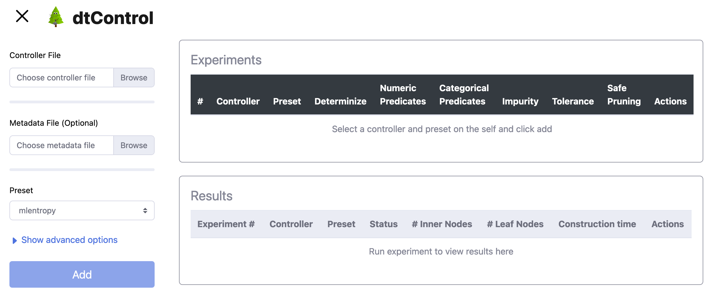

User Manual
===========

This document equips the user with the information necessary to use dtControl and run the various decision tree learning
algorithms implemented in it.

Capabilities
------------
.. youtube:: https://www.youtube.com/watch?v=qS8FQ3pCeE4

dtControl is a tool to represent controllers using `decision trees <https://en.wikipedia.org/wiki/Decision_tree>`_.
It uses `decision tree learning <https://en.wikipedia.org/wiki/Decision_tree_learning>`_ to achieve this. The 5-minute video
above gives a quick introduction to why and how one may benefit from using dtControl.

The decision tree algorithm running inside dtControl is highly configurable. You may choose to represent a
determinized controller, allow for more expressible decision predicates or even tune the heuristic used to pick the best
predicate. See :ref:`presets-and-configuration-files` for more details.

While dtControl achieves best results with permissive or non-deterministic controllers with determinization enabled,
it can also be used with deterministic controllers. However empirical results with such controllers are not as
significant as with non-deterministic controllers.

Getting Started
----------------

A quick start installation guide is available in the `README <https://gitlab.lrz.de/i7/dtcontrol/-/blob/master/README.rst>`_.
In this section, we elaborate a little more on the installation process.

.. _installation:

Installation
^^^^^^^^^^^^^^^^^

Getting `dtControl <https://pypi.org/project/dtcontrol/>`_ from the Python Package Index (PyPI) is the recommended way to install it.
Before running the ``pip install`` command, we recommend creating a virtual environment so that dependencies of dtControl
do not conflict with any other packages already installed on your system. The official Python documentation for `creating virtual
environments <https://docs.python.org/3/library/venv.html#creating-virtual-environments>`_ may help you set it up. However,
we provide the most essential information here.

Once you have a recent version of Python 3 installed, you may run::

    $ python3 -m venv venv

to create the virtual environment in a folder called ``venv`` located in your current directory. You can enter the
virtual environment by running::

    $ source venv/bin/activate

Typically, your shell might indicate that the virtual environment is activated by changing the prompt symbol ``$`` to
something like ``(venv) $``. You can now proceed with installing dtControl from PyPI using ``pip``::

    (venv) $ pip install dtcontrol

.. note::
    In case you want to get the development version of dtControl, you could instead run::

        (venv) $ pip install git+https://gitlab.lrz.de/i7/dtcontrol.git

Once the dtControl package is installed, the command line interface can be accessed using the ``dtcontrol`` command.
Try running::

   (venv) $ dtcontrol -h

If your installation has run successfully, you will now see the help page detailing the usage and arguments.::

   usage: dtcontrol [-h] [-v] [--input INPUT [INPUT ...]] [--output OUTPUT] [--benchmark-file FILENAME] [--config CONFIGFILE] [--use-preset USE_PRESET [USE_PRESET ...]] [--rerun]
                 [--timeout TIMEOUT]
                 {preset,clean} ...

    Scroll to the end of the help message for Quick Start.

    optional arguments:
      -h, --help            show this help message and exit
      -v, --version         show program's version number and exit

    input/output:
      --input INPUT [INPUT ...], -i INPUT [INPUT ...]
                            The input switch takes in one or more space separated file names or a folder name which contains valid controllers (.scs, .dump or .csv)
      --output OUTPUT, -o OUTPUT
                            The output switch takes in a path to a folder where the constructed controller representation would be saved (c and dot)
      --benchmark-file FILENAME, -b FILENAME
                            Saves statistics pertaining the construction of the decision trees and their sizes into a JSON file, and additionally allows to view it via an HTML file.

    run configurations:
      --config CONFIGFILE, -c CONFIGFILE
                            Specify location of a YAML file containing run configurarions. Use along with the --use-preset switch. More details in the User Manual.
      --use-preset USE_PRESET [USE_PRESET ...], -p USE_PRESET [USE_PRESET ...]
                            Run one or more presets defined in the CONFIGFILE. If the --config switch has not been used, then presets are chosen from the system-level configuration file.
                            Special parameters for this switch include 'all', 'all-user', 'all-system'. Refer the User Manual for more details.
      --rerun, -r           Rerun the experiment for all input-method combinations. Overrides the default behaviour of not running benchmarks for combinations which are already present in
                            the benchmark file.
      --timeout TIMEOUT, -t TIMEOUT
                            Sets a timeout for each method. Can be specified in seconds, minutes or hours (eg. 300s, 7m or 3h)

    other commands:
      {preset,clean}        Run 'dtcontrol COMMAND --help' to see command specific help

    Examples:
    Create a file storing run configurations
        dtcontrol preset --sample > user-config.yml

    Display all presets available with dtcontrol
        dtcontrol preset --config user-config.yml --list

    Run the 'my-config' preset on the SCOTS model located at 'examples/cps/cartpole.scs'
        dtcontrol --input examples/cps/cartpole.scs --config user-config.yml --use-preset my-config

Input format
^^^^^^^^^^^^

.. _supported-tools:

Supported tools
"""""""""""""""

dtControl currently supports the file formats generated by the tools `SCOTS <https://www.hcs.ei.tum.de/en/software/scots/>`_, `Uppaal Stratego <http://people.cs.aau.dk/~marius/stratego/>`_, and `PRISM <http://prismmodelchecker.org/>`_. To see how to add suppport for new file formats to dtControl, refer to the `Developer Manual <devman.html>`_.

SCOTS and Uppaal output ``.scs`` and ``.dump`` files, respectively, as the result of a controller synthesis process. These can directly be specified as input to dtControl.

For PRISM, dtControl expects a strategy file that maps state indices to actions and a states file that maps state indices to the corresponding values of state variables. These files can be generated by PRISM with the following options::

    prism firewire_abst.nm liveness_abst.pctl -const 'delay=50,fast=0.5000' -prop 1 -explicit -exportstrat 'firewire_abst.prism:type=actions' -exportstates 'firewire_abst_states.prism'

It is important that both files have a ``.prism`` extension and the states file has the same name as the actions file with an ``_states`` suffix.

It is also possible to run dtControl on all controllers in a given folder; the tool then simply looks for all files with one of the above extensions.

Specifying metadata
"""""""""""""""""""

While dtControl tries to obtain as much information as possible from the controller directly, it is sometimes necessary to provide additional metadata to the tool. For example, dtControl cannot know which variables in the controller are categorical, which is necessary for some of the specialized algorithms. It is also possible to specify names, e.g. for variables, which are used in the DOT output.

This metadata can be given in a JSON file named ``controller_name_config.json`` (where ``controller_name`` must match the name of the controller file), which allows to set the following options:

- ``x_column_types`` is a dictionary with two entries, ``numeric`` and ``categorical``. These entries are lists with indices specifying which variables are numeric or categorical, respectively.

- ``y_column_types`` provides the same information for the output variables.

- ``x_column_names`` is a list of variable names.

- ``x_category_names`` is a dictionary with one entry for every categorical variable (as specified in ``x_column_types[categorical]``). This entry can either be an index or a name from ``x_column_names`` and maps to a list of category names for the variable. For instance, an entry of the form ``"color": ["red", "green", "blue"]`` would mean that a 0 in the ``color`` variable stands for ``red``, a 1 means ``green``, and a 2 denotes ``blue``.

- ``y_category_names`` gives the same information for the output variables.

If any of the options in the metadata are not set, dtControl tries to fall back to reasonable defaults, such as ``x[i]`` for the column names or just integers ``i`` for the category names. By default, all variables are treated as numeric.

An example is given in form of the configuration file for the ``firewire_abst.prism`` case study::

    {
      "x_column_types": {
        "numeric": [
          0
        ],
        "categorical": [
          1
        ]
      },
      "x_column_names": [
        "clock",
        "state"
      ],
      "x_category_names": {
        "state": [
          "start_start",
          "fast_start",
          "start_fast",
          "start_slow",
          "slow_start",
          "fast_fast",
          "fast_slow",
          "slow_fast",
          "slow_slow"
        ]
      }
    }

This configuration provides the information that the two variables are ``clock`` and ``state``, the first of which is numeric and the second of which is categorical. Furthermore, a ``state`` of 0 corresponds to ``start_start``, a state of 1 to ``fast_start``, and so on. Note that, for PRISM models, dtControl automatically parses the names of the actions and it is thus not necessary to provide a ``y_category_names`` entry.

.. _the-command-line-interface:

The Command-line Interface
^^^^^^^^^^^^^^^^^^^^^^^^^^^

This section shows how to configure and run dtControl. For this purpose, we assume that you have an ``examples`` folder
in your current directory containing ``cartpole.scs``. You can choose to download all of our examples from our
`Gitlab repository <https://gitlab.lrz.de/i7/dtcontrol-examples>`_ via this
`zip archive <https://gitlab.lrz.de/i7/dtcontrol-examples/-/archive/master/dtcontrol-examples-master.zip>`_ or using `git`.
Extract the contents of the archive into a folder called ``examples`` and unzip ``cartpole.scs.zip``. Alternatively, you
can run the following commands::

    $ mkdir -p examples && cd examples
    $ wget -P examples/cps https://gitlab.lrz.de/i7/dtcontrol-examples/-/raw/master/cps/cartpole.scs.zip
    $ unzip -d ./examples/cps ./examples/cps/cartpole.scs.zip

Next, activate the virtual environment you installed dtControl in::

    $ source venv/bin/activate

.. _running-your-first-command:

Running your first command
""""""""""""""""""""""""""

Finally, you can run dtControl with the default parameters on the *cartpole* example (``cartpole.scs``), use the following command::

    (venv) $ dtcontrol --input examples/cps/cartpole.scs

This will produce some new files and folders in the current folder::

   decision_trees
   |-- default
   |   `-- cartpole
   |       |-- default.c
   |       |-- default.dot
   benchmark.json
   benchmark.html

Open ``benchmark.html`` in your favourite browser to view a summary of the results. For more details on what these files
are, see :ref:`understanding-the-output`.

.. _presets-and-configuration-files:

Presets and configuration files
"""""""""""""""""""""""""""""""

dtControl allows the user to configure the learning algorithm using "presets" defined in a "configuration file". The
presets can be chosen using the ``--use-preset`` switch and the configuration file can be chosen using the ``--config``
switch. For your convenience, we have pre-defined a bunch of preset configurations that we believe are interesting.
You can list the available presets by running::

    (venv) $ dtcontrol preset --list

This should produce the following table of presets.

===============  =============================   ======================  ============    ========     =========     ============
name             numeric-predicates              categorical-predicates  determinize     impurity     tolerance     safe-pruning
===============  =============================   ======================  ============    ========     =========     ============
default          ['axisonly']                    ['multisplit']           none           entropy      1e-05         False
cart             ['axisonly']                                             none           entropy                 
linsvm           ['axisonly', 'linear-linsvm']                            none           entropy                 
logreg           ['axisonly', 'linear-logreg']                            none           entropy                 
oc1              ['oc1']                                                  none           entropy                 
maxfreq          ['axisonly']                                             maxfreq        entropy                 
maxfreqlc        ['axisonly', 'linear-logreg']                            maxfreq        entropy                 
minnorm          ['axisonly']                                             minnorm        entropy                 
minnormlc        ['axisonly', 'linear-logreg']                            minnorm        entropy                 
sos              ['axisonly']                                             none           entropy                 
sos-safepruning  ['axisonly']                                             none           entropy                     True
linear-auroc     ['axisonly', 'linear-logreg']                            none           auroc                   
===============  =============================   ======================  ============    ========     =========     ============

The ``--use-preset`` argument takes in one or more preset names as argument. For each preset specified as argument, dtControl
will run the learning algorithm configured as described in this table and produce results in the folder: ``decision_trees/<preset_name>/<example_name>/``.

.. _configurable-options:

""""""""""""""""""""
Configurable options
""""""""""""""""""""

#. **numeric-predicates** can be used to configure the class of predicates that are considered for constructing the tree.
   It can take the values

        a. ``axisonly`` for predicates which compare a variable to a constant
        b. ``linear-logreg`` for predicates which compare a linear combination of variables to a constant (``ax + by < c``) obtained using `Logistic Regression <https://en.wikipedia.org/wiki/Logistic_regression>`_
        c. ``linear-linsvm`` for linear predicates obtained using linear `Support Vector Machines <https://en.wikipedia.org/wiki/Support-vector_machine>`_, and finally
        d. ``oc1`` for predicates obtained from the tool of `Murthy et. al <https://jhu.pure.elsevier.com/en/publications/oc1-randomized-induction-of-oblique-decision-trees-4>`_

#. **categorical-predicates** determines how non-numeric or categorical variables (such as ``color = blue``) should be
   dealt with. Currently, it only supports the option

        a. ``multisplit`` which creates a decision node with as many children as the number of possible categories the variable can take (e.g. ``color = blue``, ``color = green`` and ``color = red``).
        b. ``singlesplit`` which creates a decision node with just two children, one satisfying a categorical equality (``color = blue``) and the other that does not (``color != blue``).
        c. ``valuegrouping`` as described in M. Jackermeier's `thesis <http://mediatum.ub.tum.de/1547107?id=1547107&change_language=en>`_.

#. **determinize** determines the type of determinization used on permissive/non-deterministic controller when constructing the tree. Possible
   options are

        a. ``none`` to preserve permissiveness,
        b. ``minnorm`` to pick control inputs with the minimal norm,
        c. ``maxnorm`` to pick control inputs with the maximal norm,
        d. ``random`` to pick a control input uniformly at random,
        e. ``maxfreq`` to pick our in-house developed determinization strategy, details of which are available in M. Jackermeier's `thesis <http://mediatum.ub.tum.de/1547107?id=1547107&change_language=en>`_.
        f. ``auto`` to let dtControl automatically choose a determinization strategy; currently defaults to ``maxfreq``.

#. **impurity** allows users to choose the measure by which splitting predicates are evaluated. Possible options are

        a. ``entropy``
        b. ``gini``
        c. ``auroc``
        d. ``maxminority``
        e. ``twoing``
        f. ``multilabelentropy``
        g. ``multilabelgini``
        h. ``multilabeltwoing``

#. **tolerance** is a floating point value relevant only when choosing the ``valuegrouping`` categorical predicate.

#. **safe-pruning** decides whether to post-process the decision tree as specified in `Ashok et. al. (2019) <https://link.springer.com/chapter/10.1007%2F978-3-030-30281-8_9>`_.

.. _creating-own-presets:

"""""""""""""""""""""""""
Creating your own presets
"""""""""""""""""""""""""

As a user, you can define your own preset by mixing and matching the parameters from :ref:`configurable-options`. The presets
must be defined inside a ``.yml`` file as follows::

    presets:
      my-config:
        determinize: maxfreq
        numeric-predicates: ['axisonly']
        categorical-predicates: ['singlesplit']
        impurity: 'entropy'
        safe-pruning: False
      another-config:
        determinize: minnorm
        numeric-predicates: ['linear-logreg']
        categorical-predicates: ['valuegrouping']
        tolerance: 10e-4
        safe-pruning: False

.. note::
    The values for the keys ``numeric-predicates`` and ``categorical-predicates`` are lists. If the list contain
    more than one elements, e.g. ``numeric-predicates: ['axisonly', 'linear-svm']``, dtControl will construct predicates for
    each of the classes present (in this case, both axis-parallel and linear splits using a linear SVM) in the list and pick
    the best predicate amongst all the classes.

The above sample presets can be generated automatically and wrote into a ``user-config.yml`` file by running::

    (venv) $ dtcontrol preset --sample > user-config.yml

Now, dtControl can be run on the *cartpole* example with the ``my-config`` preset by running::

    (venv) $ dtcontrol --input examples/cps/cartpole.scs --config user-config.yml --use-preset my-config

.. _understanding-the-output:

Understanding the output
^^^^^^^^^^^^^^^^^^^^^^^^^

Once dtControl is used to run some experiments, you may notice a bunch of new files and folders::

   decision_trees
   |-- default
   |   `-- cartpole
   |       |-- default.c
   |       |-- default.dot
   |-- my-config
   |   `-- cartpole
   |       |-- my-config.c
   |       |-- my-config.dot
   benchmark.json
   benchmark.html

* ``benchmark.html`` is the central file, which summarizes all the results obtained by dtControl. It may be opened
  using a browser of your choice.
* ``benchmark.json`` is a JSON file containing all the statistics collected by the tool (tree size, bandwidth, construction
  time and other metadata). The ``benchmark.html`` file is rendered from this JSON file at the end of the experiments.
* ``default.c`` contains the C-code of the decision tree
* ``default.dot`` contains the DOT source code which can be compiled using the ``dot -Tpdf default.dot -o default.pdf`` command
  or `viewed using a web-based tool <https://dreampuf.github.io/GraphvizOnline/>`_

By default, the decision trees are stored in the ``decision_trees`` folder and the statistics are stored in the ``benchmark.json``
and ``benchmark.html`` files. This can however be customized with the help of the ``--output`` and the ``--benchmark-file``
switches. For example::

   (venv) $ dtcontrol --input examples/cps/cartpole.scs \
                                --config user-config.yml \
                                --use-preset my-config \
                                --output cartpole_trees \
                                --benchmark-file cartpole_stats

Will produce the following files and directories::

   cartpole_trees
   |-- my-config
   |   `-- cartpole
   |       |-- my-config.c
   |       |-- my-config.dot
   cartpole_stats.json
   cartpole_stats.html

Timeout
^^^^^^^

Another useful feature is timeout which can be set with the ``--timeout/-t`` switch. For example,::

   $ dtcontrol --input examples/truck_trailer.scs --timeout 3m

will run CART on the *truck_trailer* example, and time out if it is taking longer than 3 minutes to finish. The
``--timeout/-t`` switch can accept timeout in seconds, minutes and hours (``-t 42s`` or ``-t 30m`` or ``-t 1h``).
The timeouts is applied for each preset individually, and not for the whole set of experiments.

Re-run
^^^^^^

By default, new results are appended to ``benchmark.json`` (or the file passed to the ``--benchmark-file`` switch) and
experiments are not re-run if results already exist. In case you want to re-run a method and overwrite existing results,
use the ``--rerun`` flag.::

   $ dtcontrol --input examples/cps/cartpole.scs --rerun

.. _quick-start-python-interface:

Quick Start with the Python Interface
-------------------------------------

More advanced users can use dtControl programmatically using Python or as part of a Jupyter notebook. Here is an example of the Python interface with comments that give guidance on what is happening::

    # imports
    # you might have to import additional classifiers
    from sklearn.linear_model import LogisticRegression
    from dtcontrol.benchmark_suite import BenchmarkSuite
    from dtcontrol.decision_tree.decision_tree import DecisionTree
    from dtcontrol.decision_tree.determinization.max_freq_determinizer import MaxFreqDeterminizer
    from dtcontrol.decision_tree.impurity.entropy import Entropy
    from dtcontrol.decision_tree.impurity.multi_label_entropy import MultiLabelEntropy
    from dtcontrol.decision_tree.splitting.axis_aligned import AxisAlignedSplittingStrategy
    from dtcontrol.decision_tree.splitting.linear_classifier import LinearClassifierSplittingStrategy

    # instantiate the benchmark suite with a timeout of 2 hours
    # rest of the parameters behave like in CLI
    suite = BenchmarkSuite(timeout=60*60*2,
                           save_folder='saved_classifiers',
                           benchmark_file='benchmark',
                           rerun=False)

    # Add the 'examples' directory as the base where
    # the different controllers will be searched for
    # You can also choose to only include specific files
    # in the directory with the 'include' and 'exclude' list
    suite.add_datasets('examples')

    # setting up the predicates
    aa = AxisAlignedSplittingStrategy()
    logreg = LinearClassifierSplittingStrategy(LogisticRegression, solver='lbfgs', penalty='none')

    # select the DT learning algorithms we want to run and give them names
    classifiers = [
        DecisionTree([aa], Entropy(), 'CART'),
        DecisionTree([aa, logreg], Entropy(), 'LogReg'),
        DecisionTree([aa], Entropy(), 'Early-stopping', early_stopping=True),
        DecisionTree([aa], Entropy(MaxFreqDeterminizer()), 'MaxFreq', early_stopping=True),
        DecisionTree([aa], MultiLabelEntropy(), 'MultiLabelEntropy', early_stopping=True)
    ]
    # finally, execute the benchmark
    suite.benchmark(classifiers)
    # open the web browser and show the result
    suite.display_html()

As you can see, the Python interface provides mostly the same parameters as the CLI, but gives you some additional control. In particular, the following functionality is currently only supported by the Python interface:

- Using ``early_stopping`` with the label powerset method

- Parameters for safe pruning and early stopping which control the amount of nondeterminism preserved

- Choosing any determinizer for oblique splits

- Only allowing oblique splits in leaf nodes

- Various parameters of the OC1 heuristic

- The ``ScaledBincount`` impurity measure with a custom scaling function

The easiest way to get more information on the methods available in the Python interface is to directly browse the `source code <https://gitlab.lrz.de/i7/dtcontrol/-/tree/master/dtcontrol>`_ of dtControl.

.. _priority-strategy:

Assigning priorities to splitting strategies
^^^^^^^^^^^^^^^^^^^^^^^^^^^^^^^^^^^^^^^^^^^^^
If several different splitting strategies are in use, the user can assign an individual priority to the strategies. The priority is later taken into account when calculating the impurity of the predicate :math:`p_i`. The new impurity (with priority in :math:`(0,1]`) is calculated as the following:

.. math::
        \text{Impurity}_\text{new}(p_i) = \displaystyle\frac{\text{Impurity}(p_i)}{\text{Priority}}

.. note::
        The default value of ``priority`` is 1. By assigning the exclusive priority of 0, the user can specify a ``FallbackStrategy``, a strategy which should only be used if all other strategies fail.

For example, to assign a priority of 0.5 to :code:`AxisAlignedSplittingStrategy` and a priority of 0.7 to :code:`LinearClassifierSplittingStrategy`, simply add following lines::

    aa = AxisAlignedSplittingStrategy()
    aa.priority = 0.5

    logreg = LinearClassifierSplittingStrategy(LogisticRegression, solver='lbfgs', penalty='none')
    logreg = 0.7

Web-based graphical user interface
-----------------------------------
The interface is is powered by `flask <https://flask.palletsprojects.com/en/1.1.x/>`_ and `d3.js <https://d3js.org/>`_.
After succesfully installing the latest version of `dtControl 2.0` the user can access the web-based graphical user interface by running::

    $ dtcontrol-frontend

Download and open `firefox <https://www.mozilla.org/firefox/download/thanks/>`_ and navigate to `http://127.0.0.1:5000 <http://127.0.0.1:5000>`_. If your installation has run successfully, you will now see the graphical interface which is given below.

It offers a sidebar for easy selection of the controller file and hyper-parameters, an experiments table where benchmarks can be queued, and a results table in which some statistics (number of nodes, construction time, ...) of the run are provided.
Moreover, users can click on the 'eye' icon in the results table to inspect the built decision tree.

.. _running-first-experiment:

Running your first experiment
^^^^^^^^^^^^^^^^^^^^^^^^^^^^^^^

#. **Select controller file:** First, choose a controller file by clicking on the :guilabel:`Browse` Button within the 'Controller File' section. The currently supported file formats can be found in :ref:`supported-tools`. You can choose to download all of our examples from our `Gitlab repository <https://gitlab.lrz.de/i7/dtcontrol-examples>`_ via this `zip archive <https://gitlab.lrz.de/i7/dtcontrol-examples/-/archive/master/dtcontrol-examples-master.zip>`_. Make sure you unzip all files before selecting them. (Alternatively, you can follow the commands provided in :ref:`the-command-line-interface`).

#. **Optional: Select metadata file.** This step is completely optional. If wanted, the user can provide a ``json`` file containing metadata for the corresponding controller file. An example file for the 10room model can be found here:

        :download:`10rooms metadata <https://gitlab.lrz.de/i7/dtcontrol-examples/-/raw/master/cps/10rooms_config.json?inline=false>`

#. **Select preset:** In this step, the user can choose from various different preset options, presented in the section :ref:`presets-and-configuration-files`. Furthermore, we introduce two additional presents:

        a. ``custom``, which corresponds to section :ref:`configurable-options`. Upon selection this preset, the advanced options menu automatically expands.
        b. ``algebraic / user-defined``, which is described in more detail in section :ref:`algebraic-predicates`.

#. **Add experiment:** After selecting both the required controller file and the preset, the user can save this experiment by pressing the :guilabel:`Add` button. Note that the :guilabel:`Add` button is only clickable, once both required steps are done.

        .. image:: img/interface_experiment.png
            :width: 600
            :alt: screenshot of the web-based graphical user interface with an added experiment

#. **Run/ delete experiment:** After successfully adding an experiment, the corresponding experiment can be executed by pressing :fa:`play` or deleted by pressing :fa:`trash`. Alternatively, if there are several different experiments, the user can execute all of them by pressing the :fa:`play` :guilabel:`Run all` button.

        .. image:: img/interface_result.png
            :width: 600
            :alt: screenshot of the web-based graphical user interface with a finished experiment

    Once the computation is finished, the experiment will appear in the results section. The experiment can be inspected by clicking :fa:`eye`. By pressing this button, the user exits the start page and enters the 'Inspection' mode.

Inspecting your first result
^^^^^^^^^^^^^^^^^^^^^^^^^^^^^

**Select controller file:** In order to enter the 'Inspection' mode, the user has to click the :fa:`eye` symbol, within the 'Results' section. Upon clicking, a new window will appear where the computed decision tree is displayed.

    **Inspection mode:**

        .. image:: img/interface_inspect_result.png
            :width: 600
            :alt: screenshot of the web-based graphical user interface for inspecting a decision tree

    To take a look at the computed decision tree, the user can click and drag to pan and scroll to zoom. By clicking on a node, the node will collapse and absorb all its child nodes. A collapsed node can be simply expanded, by clicking again on it.

        :guilabel:`Reset focus` If you lost the orientation of the root node, simply click on the :guilabel:`Reset focus` Button to reset the focus on the root node.

        :guilabel:`Expand all` To quickly expand all collapsed nodes, simply click this button.

        :guilabel:`Collapse all` To quickly collapse all nodes within the root node, simply click this button.

Editing your first result
^^^^^^^^^^^^^^^^^^^^^^^^^^^

**Editing mode:** In order to enter the 'Editing' mode, the user has to click the :guilabel:`Edit` Button. At this point the user can either retrain the decision tree from a certain node by clicking on a node and then the :guilabel:`Retrain from selected node` Button or alternatively start the interactive tree builder from a selected node.

        :guilabel:`Retrain from selected node` Similar to the 'select preset' Section in :ref:`running-first-experiment`, the user can can specify the preset used for retraining all child nodes.

        :guilabel:`Start interactive tree builder from selected node` By selecting a node and pressing this button, the user enters the interactive tree builder mode.

        .. image:: img/interface_interactive_builder.png
            :width: 600
            :alt: screenshot of the interactive tree builder mode

        The user can now provide for the selected node, a custom predicate. For this purpose, additional information about the current state of the dataset at the current node is displayed. A user defined predicate can be added by pressing the :guilabel:`Add predicate` Button. The Syntax is described in the :ref:`algebraic-predicates` section. In the 'Instantiated Predicates', the user can now select the wanted predicate. Child nodes containing a inhomogeneous set of labels will be labeled with 'Not yet homogeneous'. For those nodes, the user can again either decide to use the 'Retrain from selected node' functionality or start again the 'interactive tree builder'.

Simulate your first result
^^^^^^^^^^^^^^^^^^^^^^^^^^^^

**Simulation mode:** The simulation mode can be entered by clicking the :guilabel:`Simulate` Button. To start the simulation, the user has to enter a system dynamics file. For this purpose we provide following two example files:

        :download:`10rooms dynamics <files/10room_dynamics.txt>`

        :download:`cartepole dynamics <files/cartpoledynamics.txt>`

        After the system dynamics file is uploaded, the user can enter some initial values for the simulation task.

        .. image:: img/interface_simulation.png
            :width: 600
            :alt: screenshot of the simulation window

        With the buttons :guilabel:`Play`, :guilabel:`Pause`, :guilabel:`Next` and :guilabel:`Previous`, the user can navigate between the different simulation steps. The corresponding path inside the decision tree, which corresponds to the current simulation values is marked with red nodes.

.. _semi-automatic-cli:

Semi-automatic command-line user interface
--------------------------------------------
In order the utilize the semi-automatic user interface the user has to import the command-line interface by adding following line to :ref:`quick-start-python-interface`::

    from dtcontrol.decision_tree.splitting.context_aware.richer_domain_cli_strategy import RicherDomainCliStrategy

Additionally, create and add the classifier::

    cli = RicherDomainCliStrategy(debug=True)

    classifiers = [
    # Interactive
    DecisionTree([cli], Entropy(), 'interactive')
    ]

After adding these lines of code, the user can follow the commands (which you may copy-paste) from this demonstration video:

.. asciinema:: img/cli.cast

.. _algebraic-predicates:

Algebraic user-defined predicates
-----------------------------------
The support for algebraic user-defined predicates forms one of the cornerstones of ``dtControl 2.0``. In this subsection we introduce several different extensions for predicates. The most simplified predicate structure can be summarized as follows:

.. _standard-predicates:

Standard predicate
^^^^^^^^^^^^^^^^^^^

.. math::

   \textit{term} \sim \textit{term}

Where :math:`\textit{term}` is an arbitrary arithmetic term, using any elementary function that can be parsed by `SymPy <https://www.sympy.org>`_. :math:`\sim` is a standard comparator from the set :math:`\{\texttt{<=,>=,<,>,=}\}`.

.. note::
    The :math:`i` -th feature can be referenced by typing :code:`x_i`. With :math:`i \in \mathbb{N}_0` and :code:`x_0` referencing the first feature.

**Some arbitrary examples:**

====================================================================================================  ========================================================================
Example standard predicate                                                                              dtControl syntax
====================================================================================================  ========================================================================
:math:`x_0 \leq 0.5`                                                                                    :code:`x_0 <= 0.5`
:math:`x_0 * 12 + x_1 * 3 \ge x_0 * 2 - x_2 * 3`                                                        :code:`x_0 * 12 + x_1 * 3 >= x_0 * 2 - x_2 * 3`
:math:`\sqrt{x_0} * x_2 + log(x_1) - \displaystyle\frac{x_2}{x_3} \leq x_4`                             :code:`sqrt(x_0) * x_2 + log(x_1) - (x_2)/(x_3) <= x_4`
:math:`1.0546e-34 + 90 - x_2 \ge x_0`                                                                   :code:`1.0546e-34 + 90 - x_2 >= x_0`
:math:`e^{10} + ln(2) + \displaystyle\frac{x_1}{x_2} \ge 0`                                             :code:`e^10 + ln(2) + (x_1)/(x_2) >= 0`
:math:`sin(cos(12)) + x_2^{x_3} \leq x_1`                                                               :code:`sin(cos(12)) + x_2^(x_3) <= x_1`
====================================================================================================  ========================================================================

Coefficient predicates
^^^^^^^^^^^^^^^^^^^^^^^^^
Coefficients overcome the limitations of standard predicates by enabling the usage of coefficients within :math:`\textit{term}`. In `dtControl 2.0` we distinguish between **finite** and **infinite** coefficients.

    **Finite coefficients:** In order to bundle different variations of one single predicate, we introduce finite coefficients. The concept builds upon :ref:`standard-predicates` and can be describes as the following:

    .. math::
        \textit{term}_f \sim \textit{term}_f \textit{; def}

    With the extension of :math:`\textit{term}_f` being an arbitrary algebraic term using Finite Coefficients defined in :math:`\textit{def}`. The general idea is to utilize Finite Coefficients :math:`c_i` within :math:`\textit{term}_f` and extend the finished predicate with a semicolon, followed by the concrete coefficient definition :math:`C_i \subseteq \mathbb{R}` with :math:`c_i \in C_i`.

    .. note::
        For computational reasons, the only restriction we insist on is :math:`|C_i| \in \mathbb{N}`. However, it should be noted that specifying too many or too large sets results in an infeasibly large set of predicates.

    **Some arbitrary examples:**

        ==============================================================================================================================================================================================================================================  ========================================================================
        Example finite coefficient predicate                                                                                                                                                                                                             dtControl syntax
        ==============================================================================================================================================================================================================================================  ========================================================================
        :math:`\sqrt{x_0} * c_0 + log(x_1) - \displaystyle\frac{x_2}{c_1} \leq c_2 \text{; }c_0 \in \{-\frac{1}{3},\frac{1}{3}\} \text{; } c_1  \in  \{1,2\} \text{; } c_2  \in \{\sqrt{2}, \pi\}`                                                          :code:`sqrt(x_0) * c_0 + log(x_1) - (x_2 / c_1) <= c_2; c_0 in {-(1/3),(1/3)}; c_1 in {1, 2}; c_2 in {sqrt(2), pi}`
        :math:`1.0546e-34 + 90 - c_0 \ge x_0 \text{; }c_0  \in \{0,12\}`                                                                                                                                                                                    :code:`1.0546e-34 + 90 - c_0 >= x_0; c_0 in {0,12}`
        :math:`e^{10} + ln(2) + \displaystyle\frac{x_2}{c_0} \ge 0 \text{; }c_0  \in \{-\frac{1}{9},\frac{2}{3}\}`                                                                                                                                          :code:`e^10 + ln(2) + (x_2 / c_0) >= 0; c_0 in {-(1/9), (2/3)}`
        :math:`sin(cos(12)) + c_0^{c_1} \leq x_1 \text{; }c_0  \in \{1,2,3\} \text{; } c_1  \in \{4\}`                                                                                                                                                      :code:`sin(cos(12)) + c_0^(c_1) <= x_1; c_0 in {1,2,3}; c_1 in{4}`
        ==============================================================================================================================================================================================================================================  ========================================================================

    **Infinite coefficients:** Infinite coefficients extend the concept of finite coefficients and enable the usage of more generic terms. Building upon the structure of Finite Coefficients, predicates using infinite coefficients can be described as the following:

    .. math::
        \textit{term}_i \sim \textit{term}_i

    With the extension of :math:`\textit{term}_i` being an arbitrary algebraic term using infinite coefficients. Infinite coefficients can be used throughout the term without defining them. `dtControl 2.0` uses `SciPy <https://docs.scipy.org/doc/scipy/reference/generated/scipy.optimize.curve_fit.html>`_ to heuristically determine their exact substituted value.

    .. note::
        The difference between **infinite** and **finite** coefficients is that latter need a concrete definition whereas **infinite** coefficients can be seen as a placeholder for 'perfect'-fitting value.

    .. warning::
        It should be avoided to combine too many finite and infinite coefficients together as that can easily end up in a combinatorial explosion.

        **Example:**
        The following predicate :math:`x_1 * c_0 >= c_1\text{; }c_0  \in \{1,2\}\text{; }c_1  \in \{1,2,3\}` bundles **6** predicates together.

            #. :math:`x_1 * 1 >= 1`
            #. :math:`x_1 * 1 >= 2`
            #. :math:`x_1 * 1 >= 3`
            #. :math:`x_1 * 2 >= 1`
            #. :math:`x_1 * 2 >= 2`
            #. :math:`x_1 * 2 >= 3`

Feature Constraints
^^^^^^^^^^^^^^^^^^^^^^^
The concept of Feature Constraints is provided for explicit situations where the usage of a predicate is only valid under certain constraints within the current controller file. Similar to the previous sections of coefficient predicates, predicates using Feature Constraints can be described as the following:

    .. math::
        \textit{term}_i \sim \textit{term}_i \textit{; def}_f

With the extension of :math:`\textit{def}_f` containing the explicit feature constraints. Similar to the **finite** coefficients, the user can specify the valid range with a by declaring a set with accepted values. Additionally, we also enabled the usage of infinite sets by declaring an interval of the structure :code:`[a,b)`, :code:`[a,b]`, :code:`(a,b)` or :code:`(a,b]` with :math:`a,b \in \mathbb{R}\cup \{-\infty, \infty\}`. To utilize :math:`\infty` simply type :code:`Inf`, :code:`infinity` or :code:`oo`. Additionally, we support the possibility to union several different sets by using the keywords :code:`or` or :code:`u`.

    .. note::
        :math:`(a,b) = \{ x \in \mathbb{R} | a < x < b\}`

        :math:`[a,b) = \{ x \in \mathbb{R} | a \leq x < b\}`

        :math:`(a,b] = \{ x \in \mathbb{R} | a < x \leq b\}`

        :math:`[a,b] = \{ x \in \mathbb{R} | a \leq x \leq b\}`

    **Some arbitrary examples:**

        ==================================================================================================================================================  ================================================================================================================================================
        Example predicates with **finite** feature constraints                                                                                                  dtControl syntax
        ==================================================================================================================================================  ================================================================================================================================================
        :math:`x_0 \leq 0.5 \text{; }x_0 \in \{1,2,3,\displaystyle\frac{1}{3}\}`                                                                            :code:`x_0 <= 0.5; x_0 in {1,2,3,1/3}`
        :math:`x_0 + x_1 \leq 3.9 \text{; }x_0 \in \{\displaystyle\frac{1}{3}\}; x_1 \in [1,2) \cup (-\infty,-123]`                                         :code:`x_0 <= 0.5; x_0 in {1/3}; x_1 in [1,2) or (-Inf,-123]`
        :math:`\sqrt{x_0} * c_0 + log(x_1) \geq x_2 * c_1\text{; }x_0 \in \{ \pi \}; x_1 \in [\sqrt{2},\infty); c_0 \in \{1,2,\pi \}; x_1 \in \{1,2\}`      :code:`sqrt(x_0) * c_0 + log(x_1) >= x_2 * c_1; x_0 in {pi}; x_1 in [sqrt(2),Inf); c_0 in {1,2,pi}; x_1 in {1,2}`
        ==================================================================================================================================================  ================================================================================================================================================

