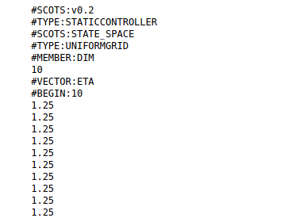
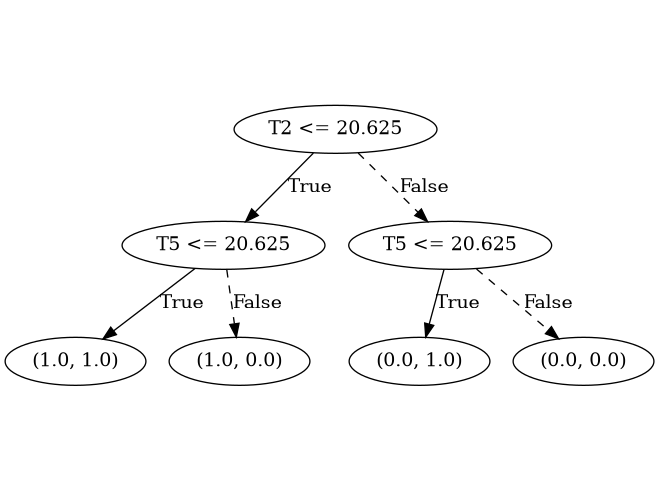

**dtControl** is a tool for compressing memoryless controllers, e.g. arising out of automatic controller synthesis of 
cyber-physical systems (CPS) or probabilistic model checking. dtControl takes as input a controller synthesised by various formal verification 
tools and represents them in the form of decision trees. An example is shown below:

{::options parse_block_html="true" /}
<div class="image-container">
<div class="fixed">

<div class="caption">
Controller of an automatic climate control system for a building with 10 rooms obtained from SCOTS
</div>
</div>
<div class="flex-item">

<div class="caption">
Small and explainable decision tree of the same controller (determinized) as output by dtControl
</div>
</div>
</div>

Currently dtControl supports controller output generated by the tools [SCOTS](https://www.hcs.ei.tum.de/en/software/scots/),
[Uppaal Stratego](http://people.cs.aau.dk/~marius/stratego/), [PRISM](http://prismmodelchecker.org/),
and [Storm](https://www.stormchecker.org/).


To learn more about dtControl and representing controllers using decision trees, you may want to watch our [demo](https://www.youtube.com/watch?v=qS8FQ3pCeE4)
or [talk](https://www.youtube.com/watch?v=K6d3pS6Ege0) at HSCC 2020, take a look at our 
[tool manual](https://dtcontrol.readthedocs.io) or read our [HSCC 2020 paper](https://arxiv.org/abs/2002.04991).
The latest features including support of algebraic predicates, categorical predicates, a semi-automatic interface, 
GUI with several interactive modes, new determinization procedure and an interface for model checkers PRISM and Storm, 
can be found in our latest [TACAS 2021 paper](https://arxiv.org/abs/2101.07202).
 

## Quick Start

You can quickly install **dtControl** by running the following command

```
pip install dtcontrol
```

Check whether **dtControl** has installed by running

```
dtcontrol --version
```

As a quick example, you may download the controller generated by SCOTS for the climate control example shown above by running

```
wget https://gitlab.lrz.de/i7/dtcontrol/raw/6dd07a5991a0e0a7992c9f7c94e1b9c75c7d94e3/examples/10rooms.scs.zip \
&& unzip 10rooms.scs.zip
```

following which you may use **dtControl** to generate a decision tree.

```
dtcontrol --input 10rooms.scs --use-preset maxfreq
```

The above command, if executed successfully, will generate a files `benchmark.html`, `benchmark.json` and a folder `decision_trees` which contain the output of the run. You may open the `benchmark.html` file in any browser to access the generated trees.

## Manuals / Documentation

Our complete documentation including user and developer manuals are available at [dtcontrol.readthedocs.io](https://dtcontrol.readthedocs.io). Please ensure that you are referring to the correct version of the documentation. Additionally, we provide [video tutorials][2], covering the most aspects of **dtControl**.

## Artifact evaluation

**dtControl** has undergone several artifact evaluation processes. All the resources for that are available [here][1].

## Contact

For questions, suggestions and comments, you may contact [Mathias](mailto:jackerme@in.tum.de), [Pranav](mailto:ashok@in.tum.de), [Maxi](mailto:maxi.weininger@tum.de), [Christoph](mailto:christoph.weinhuber@tum.de) or [Jan](mailto:jan.kretinsky@tum.de). We would also be glad to help you incorporate **dtControl** into your controller synthesis/usage workflow. Other feature requests are also welcome.

## Citing

Cite **dtControl** in academic publications as:

- *Pranav Ashok, Mathias Jackermeier, Jan Kretínský, Christoph Weinhuber, Maximilian Weininger, Mayank Yadav.*
**dtControl 2.0: Explainable Strategy Representation via Decision Tree Learning Steered by Experts.**
*TACAS 21.*
<br />
[view](https://doi.org/10.1007/978-3-030-72013-1_17) / [bibtex](https://dblp.uni-trier.de/rec/bibtex/conf/tacas/AshokJKWWY21) / [pre-print](https://arxiv.org/abs/2101.07202)
  
## Related Publications

**dtControl** was first introduced in:

- *Pranav Ashok, Mathias Jackermeier, Pushpak Jagtap, Jan Kretínský, Maximilian Weininger, Majid Zamani.*
**dtControl: Decision Tree Learning Algorithms for Controller Representation.**
*HSCC 2020.*
<br />
[view](https://dl.acm.org/doi/abs/10.1145/3365365.3382220) / [bibtex](https://dblp.uni-trier.de/rec/bibtex/journals/corr/abs-2002-04991) / [pre-print](https://arxiv.org/abs/2002.04991)

Other closely related publications include:

- *Pranav Ashok, Tomás Brázdil, Krishnendu Chatterjee, Jan Kretínský, Christoph H. Lampert, Viktor Toman.*
**Strategy Representation by Decision Trees with Linear Classifiers.**
*QEST 2019.*
<br />
[view](https://doi.org/10.1007/978-3-030-30281-8_7) / [bibtex](https://dblp.uni-trier.de/rec/bibtex/conf/qest/AshokBCKLT19) / [pre-print](http://arxiv.org/abs/1906.08178) 

- *Pranav Ashok, Jan Kretínský, Kim Guldstrand Larsen, Adrien Le Coënt, Jakob Haahr Taankvist, Maximilian Weininger.*
**SOS: Safe, Optimal and Small Strategies for Hybrid Markov Decision Processes.**
*QEST 2019.*
<br />
[view](https://doi.org/10.1007/978-3-030-30281-8_9) / [bibtex](https://dblp.uni-trier.de/rec/bibtex/conf/qest/AshokKLCTW19) / [pre-print](http://arxiv.org/abs/1906.10640) 

- *Tomás Brázdil, Krishnendu Chatterjee, Martin Chmelik, Andreas Fellner, Jan Kretínský*.
**Counterexample Explanation by Learning Small Strategies in Markov Decision Processes.**
*CAV 2015*
<br />
[view](https://doi.org/10.1007/978-3-319-21690-4_10) / [bibtex](https://dblp.org/rec/bibtex/conf/cav/BrazdilCCFK15) / [pre-print](https://arxiv.org/abs/1502.02834)

[1]:{{ site.url }}/artifacts
[2]:{{ site.url }}/tutorials
